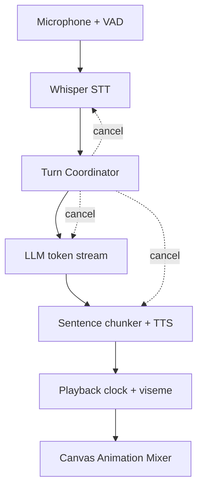

# Cybergirl 3.5: A Local-First Vietnamese Realtime AI Companion

**Technical preprint · Working paper · Chưa phản biện đồng cấp**

- Tác giả: **Long Ngo**
- Dự án: **Base27-CVNSS / Cybergirl**
- Phiên bản mô tả: **3.5.0**
- Ngày cập nhật: **29-07-2026**
- Mã nguồn: <https://github.com/Base27-CVNSS/Avatar>
- Trang giới thiệu: <https://base27-cvnss.github.io/Avatar/>
- Giấy phép mã nguồn: [MIT](LICENSE)

> Tài liệu này là báo cáo kỹ thuật đi kèm mã nguồn, không phải bài báo đã xuất bản,
> chưa có DOI và chưa qua phản biện đồng cấp. Các mức 7–9/10 trong README là mục
> tiêu kiến trúc/nghiệm thu; không thay thế benchmark tái lập trên phần cứng cụ thể.

## Tóm tắt

Cybergirl 3.5 là một AI Companion tiếng Việt theo hướng local-first dành cho
Windows và Microsoft Edge. Hệ thống dùng pipeline phân tách gồm phát hiện tiếng
nói, nhận dạng giọng nói, mô hình ngôn ngữ, tổng hợp giọng và animation bán thân.
Các khối trao đổi qua sự kiện, hàng đợi và định danh lượt để cho phép sinh phản hồi
theo luồng, phát TTS theo câu và ngắt lời xuyên suốt pipeline.

Đóng góp kỹ thuật chính của phiên bản 3.5 gồm: bộ điều phối lượt có cancellation;
adapter LLM đọc SSE/JSONL; bộ tách câu cho TTS gần thời gian thực; timeline viseme
được lấy mẫu theo frame và bù trễ từ mốc playback native; cùng Motion Rig Canvas 2D
điều khiển mắt, môi, mũi, trán, tóc, nhịp thở, vai và vùng tay trên ảnh nguồn.

## 1. Bài toán

Một avatar thoại tự nhiên phải giải quyết đồng thời bốn yêu cầu:

1. phản hồi sớm thay vì chờ toàn bộ câu trả lời;
2. dừng lượt cũ khi người dùng nói xen vào;
3. giữ âm thanh, viseme và chuyển động trên một timeline nhất quán;
4. vận hành được trên máy Windows phổ thông với lựa chọn xử lý cục bộ.

Các phiên bản dựa hoàn toàn vào Web Speech và timer ký tự có thể tạo trải nghiệm
“ảnh tĩnh biết mở miệng”, nhưng không đảm bảo clock âm thanh, cancellation xuyên
module hoặc chuyển động bán thân có điều phối.

## 2. Kiến trúc



### 2.1. Điều phối lượt

Mỗi lượt hội thoại có `turn_id` tăng đơn điệu và một cancellation token dùng
chung. Khi VAD phát hiện lời nói mới, hệ thống vô hiệu hóa lượt cũ, terminate tiến
trình STT/TTS có thể dừng, đóng stream LLM, dừng playback và loại bỏ sự kiện đến
muộn không còn khớp `turn_id`.

### 2.2. Sinh và phát theo luồng

Các adapter OpenAI Responses, OpenRouter, Ollama và endpoint tương thích OpenAI
đọc token từ SSE hoặc JSONL. Một bộ tách câu hữu hạn gom token thành đoạn đủ ngắn
cho SAPI/Piper. Nhờ vậy, TTS có thể bắt đầu sau câu đầu thay vì đợi toàn bộ phản
hồi. Gemini batch được xử lý theo cơ chế loại kết quả cũ, nhưng việc dừng tính toán
phía máy chủ chỉ là best-effort.

### 2.3. Đồng bộ môi

Frontend dùng một timeline viseme duy nhất, được lấy mẫu trong vòng render thay vì
tạo timer riêng cho từng âm. Đường native gửi `playback_started_unix_ms` để bù
trễ vận chuyển. Edge Web Speech dùng Vietnamese G2P kết hợp boundary re-anchor;
audio/WAV dùng thời lượng thật và đặc trưng phổ ba dải.

Đây chưa phải đồng hồ sample-accurate vì SAPI/Piper hiện phát WAV theo câu và chưa
cấp `playedSamples / sampleRate` qua AudioWorklet.

### 2.4. Motion Rig bán thân

Motion Rig chia ảnh nguồn thành các vùng mềm cho tóc, trán, mũi, thân, vai và tay.
Animation Mixer kết hợp nhịp thở, gaze, blink, emotion và gesture semantic trong
cùng vòng render 30 FPS. LLM chỉ chọn nhãn như `welcome`, `explain`,
`point_left`, `point_right` hoặc `open_hands`; renderer quyết định biên độ,
mask và ưu tiên.

Motion Rig là biến dạng Canvas 2D. Hệ thống không tái tạo vùng ảnh bị che và không
sinh bàn tay mới; cử động tay phụ thuộc ảnh nguồn có sẵn vai/cánh tay/bàn tay.

## 3. Lựa chọn triển khai

| Khối | Lựa chọn cục bộ | Lựa chọn từ xa |
|---|---|---|
| VAD | Silero VAD ONNX | Không cần |
| STT | Whisper/whisper.cpp | Có thể mở rộng |
| LLM | llama.cpp GGUF, Ollama | OpenAI, Gemini, OpenRouter, compatible |
| TTS | Windows SAPI, Piper | Edge Web Speech/fallback |
| Avatar | Face Mesh + Canvas/WASM | Không gửi ảnh/landmark |

Ba hồ sơ Lite, Balanced và Pro thay đổi context, số lớp GPU offload và mức chuyển
động. Cấu hình Pro chỉ có ý nghĩa khi llama.cpp dùng GPU backend tương thích.

## 4. Quyền riêng tư

Ảnh chân dung, landmark Face Mesh và biến dạng avatar được xử lý trên thiết bị.
Microphone có thể đi qua Whisper cục bộ. Chỉ văn bản hội thoại được gửi ra ngoài
khi người dùng chủ động chọn nhà cung cấp API. Khóa API giữ trong RAM; bộ nhớ dài
hạn SQLite mặc định tắt và chỉ bật khi có đồng ý.

## 5. Phương pháp đánh giá đề xuất

Các số đo phải lấy trên cùng phần cứng, model, profile và bộ câu tiếng Việt:

| Chỉ số | Định nghĩa | Mục tiêu |
|---|---|---:|
| Endpoint latency | im lặng cuối câu → STT bắt đầu | P95 ≤ 350 ms |
| LLM TTFT | gửi prompt → token đầu | P95 ≤ 700 ms local |
| First audio | speech-end → mẫu âm đầu tiên | P95 < 2.000 ms |
| Barge-in stop | speech-start mới → audio lượt cũ dừng | P95 ≤ 150 ms |
| Lip-sync offset | mốc âm vị → cực đại viseme tương ứng | P95 ≤ 80 ms với PCM clock |
| Frame time | thời gian render Animation Mixer | P95 < 33 ms ở 30 FPS |

Repository hiện ghi `stt_ms`, `llm_ttft_ms`, `llm_total_ms` và
`first_audio_ms`. Hai mục sample-accurate lip-sync và PCM clock là hướng nâng cấp
tiếp theo, không được xem là đã hoàn tất trong 3.5.

## 6. Kết quả hiện tại và giới hạn

Phiên bản 3.5 đã mã hóa và kiểm thử đường cancellation theo lượt, token streaming,
sentence chunker, gesture selection, Motion Rig và đồng bộ phiên bản Windows.
GitHub Actions tạo GUI, Native Companion, Edge ZIP và installer.

Giới hạn chính:

- STT vẫn batch theo phát ngôn hoàn chỉnh;
- TTS streaming theo câu, chưa phát PCM chunk;
- Motion Rig phụ thuộc chất lượng và bố cục ảnh nguồn;
- không có skeleton 3D, inverse kinematics hoặc mô hình sinh chuyển động;
- benchmark 7–9/10 cần được chạy lại trên phần cứng mục tiêu;
- chất lượng tổng thể phụ thuộc model GGUF, microphone, voice và GPU backend.

## 7. Khả năng tái lập

1. Clone repository và đọc [README](README.md).
2. Cài theo mục Windows hoặc chạy pipeline phát triển.
3. Chọn một profile cố định và ghi cấu hình CPU/GPU/RAM.
4. Chạy cùng bộ câu tiếng Việt, tối thiểu 30 lượt cho mỗi điều kiện.
5. Báo median, P95, lỗi endpoint, tỷ lệ lượt hủy đúng và frame time.
6. Công bố model, quantization, context, TTS voice và ngưỡng VAD.

## 8. Citation

Nếu sử dụng mã nguồn hoặc kiến trúc trong nghiên cứu, có thể trích dẫn working
paper bằng BibTeX sau:

```bibtex
@techreport{ngo2026cybergirl,
  title       = {Cybergirl 3.5: A Local-First Vietnamese Realtime AI Companion},
  author      = {Ngo, Long},
  institution = {Base27-CVNSS},
  year        = {2026},
  type        = {Technical Preprint},
  url         = {https://github.com/Base27-CVNSS/Avatar},
  note        = {Working paper, not peer reviewed}
}
```

## 9. License

Mã nguồn Cybergirl phát hành theo [MIT License](LICENSE). Tài liệu này mô tả phần
mềm và không thay đổi giấy phép riêng của các model hoặc thành phần bên thứ ba;
xem [THIRD_PARTY_NOTICES.md](THIRD_PARTY_NOTICES.md).
