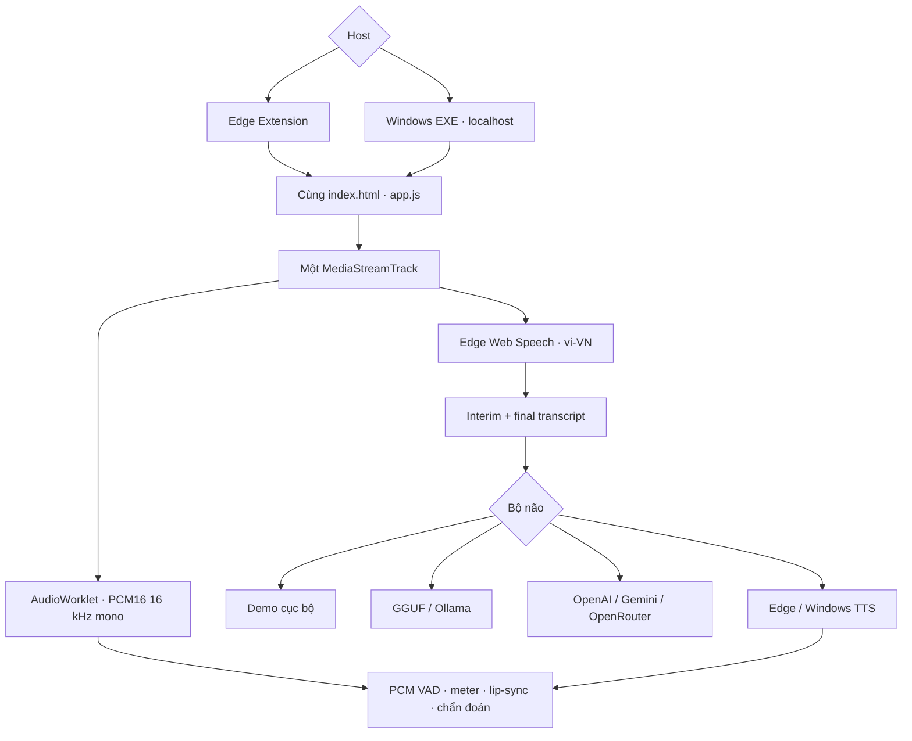

# Cybergirl 5.2 — Avatar AI tiếng Việt cho Edge và Windows


[](CHANGELOG.md)
[](docs/PCM-CONTRACT.md)
[](https://learn.microsoft.com/en-us/microsoft-edge/web-platform/speech-recognition-api)
[](.github/workflows/build-windows.yml)
[](LICENSE)

**Một mã nguồn giao diện, một engine microphone và một hợp đồng PCM cho cả
Microsoft Edge Extension lẫn ứng dụng Windows.**

Cybergirl biến ảnh chân dung thành avatar có thể nghe tiếng Việt, chép lời,
trò chuyện, phát giọng và nhép môi. Bản 5.2 hợp nhất đường âm thanh của hai bản:
một `MediaStreamTrack` được dùng đồng thời bởi AudioWorklet PCM16 và Edge
`SpeechRecognition`.

## Chạy ngay

### Edge Extension

1. Tải `Cybergirl-Edge-v5.2.0.zip` trong **Actions** hoặc **Releases**.
2. Giải nén; mở `edge://extensions`.
3. Bật **Chế độ nhà phát triển** → **Tải tiện ích đã giải nén**.
4. Chọn thư mục có `manifest.json`, sau đó bấm biểu tượng Cybergirl.
5. Cho phép microphone và bấm **Bắt đầu Chat live**.

Chế độ **Demo cục bộ** hoạt động ngay, không cần model, API key hoặc companion.
Ảnh, PCM, lip-sync và phản hồi mẫu đều chạy trong Edge.

### Windows chạy ngay

Tải một trong hai tệp:

- `Cybergirl-Windows-x64.exe`: một tệp EXE, mở trực tiếp.
- `Cybergirl-Setup-v5.2.0-Windows-x64.exe`: bộ cài tiếng Việt, có shortcut.

Ứng dụng tự mở Microsoft Edge ở chế độ cửa sổ app. Người dùng không cần cài
Python, Node.js, CUDA hoặc model để chạy Demo. Khi cần LLM thật, chọn Ollama,
GGUF, OpenAI, Gemini, OpenRouter hoặc endpoint tương thích OpenAI.

## Kiến trúc hợp nhất



Không có hai bản sao của frontend:

| Thành phần dùng chung | Extension | Windows EXE |
|---|---:|---:|
| `index.html`, `styles.css`, `app.js` | ✅ | ✅ |
| `audio/pcm-web-speech.js` | ✅ | ✅ |
| `audio/pcm16-processor.js` | ✅ | ✅ |
| Face Mesh, Mouth Engine, avatar 4K/8K | ✅ | ✅ |
| Demo tiếng Việt | ✅ | ✅ |
| Edge Web Speech `vi-VN` | ✅ | ✅ |
| Backend LLM/API cục bộ | Companion tùy chọn | Có sẵn trong EXE |

Chi tiết: [Kiến trúc 5.2](docs/ARCHITECTURE-5.2.md) và
[Hợp đồng PCM](docs/PCM-CONTRACT.md).

## Hợp đồng âm thanh duy nhất

| Trường | Giá trị bắt buộc |
|---|---|
| Track nguồn | `MediaStreamTrack`, `kind=audio`, `readyState=live` |
| Đầu vào hệ điều hành | Thường 44,1 hoặc 48 kHz Float32 |
| PCM chuẩn hóa | signed PCM16 little-endian (`s16le`) |
| Tần số | 16.000 Hz |
| Kênh | mono |
| Gói | 20 ms, 320 mẫu, 640 byte |
| STT | Edge `SpeechRecognition`, ngôn ngữ `vi-VN` |
| Liên kết STT | `recognition.start(audioTrack)`; fallback micro mặc định trên Edge cũ |

AudioWorklet trộn kênh, resample và lượng tử hóa ngoài main thread. Ba gói tín
hiệu liên tiếp vượt noise floor mới được đánh dấu là PCM thật. Nếu track vẫn
`live` nhưng chỉ có digital silence, engine thử lại bằng profile tương thích.

> PCM16 không phải là một phần của Web Speech API. Cybergirl tự tạo PCM16 từ
> đúng track được chuyển cho Web Speech, nhờ đó telemetry, VAD và lip-sync không
> đọc nhầm một nguồn khác.

## Web Speech tiếng Việt và quyền riêng tư

Cybergirl đặt `recognition.lang = "vi-VN"` và để
`recognition.processLocally = false`. Theo tài liệu Microsoft tháng 6/2026,
model nhận dạng **on-device** thử nghiệm của Edge 150 chưa liệt kê tiếng Việt.
Vì vậy `processLocally=true` có thể làm `vi-VN` thất bại.

- PCM, ảnh, landmark và dữ liệu avatar do Cybergirl xử lý vẫn ở trong Edge.
- Edge Web Speech có thể dùng dịch vụ nền tảng/đám mây của Microsoft, tùy phiên
  bản Edge, Windows, policy và vùng.
- Nếu tổ chức chặn `SpeechRecognitionEnabled`, ứng dụng sẽ báo đúng nguyên nhân.
- Không gửi PCM tới backend LLM; backend chỉ nhận văn bản sau nhận dạng.

Tham chiếu:
[Microsoft Edge SpeechRecognition](https://learn.microsoft.com/en-us/microsoft-edge/web-platform/speech-recognition-api) và
[`SpeechRecognition.start(audioTrack)`](https://developer.mozilla.org/en-US/docs/Web/API/SpeechRecognition/start).

## Điểm nổi bật 5.2

- Extension và Windows dùng một frontend, không copy thuật toán.
- PCM16 mono 16 kHz cố định qua AudioWorklet.
- Edge Web Speech nhận cùng track microphone với pipeline PCM.
- Chọn thiết bị đầu vào Windows và lưu lựa chọn an toàn.
- Tự nối lại Web Speech khi Edge kết thúc phiên.
- Nút **Làm mới đầu vào PCM** đổi sang profile tương thích.
- Telemetry trực tiếp: định dạng, sample rate, RMS, track mode và trạng thái STT.
- Demo cục bộ chạy ngay, không mạng và không khóa.
- Avatar trên, chat dưới; ghi âm, phát lại, chụp PNG, ảnh 8K và WebM.
- Mouth Engine giữ môi/răng thật, feather mask và viseme tiếng Việt.
- Mắt, chớp mắt, gaze, chuyển động đầu và cảm xúc theo ngữ cảnh.
- Barge-in và echo-guard khi người dùng ngắt lời TTS.
- GGUF/llama.cpp, Ollama, OpenAI Responses, Gemini, OpenRouter và API compatible.
- API key chỉ giữ trong RAM; không ghi vào `localStorage`, SQLite hoặc tệp cấu hình.
- Windows EXE lắng nghe trên `127.0.0.1` và dùng token phiên cho POST API.

## Đối chiếu 30 khối

| # | Khối | Cybergirl 5.2 |
|---:|---|---|
| 1 | Ảnh/Avatar | Face Mesh + Canvas + ảnh 4K/8K |
| 2 | Mắt/miệng | Hiệu chỉnh 5 điểm + mouth patch thật |
| 3 | Chớp mắt | Đơn/kép, nhịp theo cảm xúc |
| 4 | Chuyển động đầu | Micro-motion theo activity |
| 5 | Microphone | Một track Edge/Windows dùng chung |
| 6 | PCM | s16le, 16 kHz, mono, gói 20 ms |
| 7 | VAD | Noise floor + xác minh tín hiệu thật |
| 8 | STT | Edge Web Speech `vi-VN` |
| 9 | Chọn thiết bị | Danh sách input Windows |
| 10 | Phục hồi input | Processed ↔ compatibility |
| 11 | Hội thoại | Interim/final → brain → TTS |
| 12 | Demo | Chạy ngay không model/API |
| 13 | LLM | GGUF/Ollama/OpenAI/Gemini/OpenRouter |
| 14 | System prompt | Registry Mai/Linh/An |
| 15 | Bộ nhớ | RAM + SQLite opt-in |
| 16 | TTS | Edge/Windows SAPI/Piper |
| 17 | Lip-sync text | Viseme tiếng Việt theo timeline |
| 18 | Lip-sync audio | PCM envelope + phổ tần |
| 19 | Coarticulation | Attack/release liên âm |
| 20 | Ngắt lời | VAD barge-in + hủy TTS |
| 21 | Full-duplex | Mic tiếp tục mở + echo-guard |
| 22 | Emotion | Phân tích tiếng Việt cục bộ |
| 23 | Emotion → mặt | Gaze, blink, head energy |
| 24 | Hot-swap | Nhân vật, model, voice |
| 25 | Chẩn đoán | PCM/RMS/track/Web Speech/LLM/TTS |
| 26 | Ghi âm | MediaRecorder cục bộ tối đa 5 phút |
| 27 | Xuất ảnh | PNG và master 7680×4320 |
| 28 | Xuất video | Canvas + audio → WebM |
| 29 | Extension | Manifest V3, click là mở |
| 30 | Windows | EXE một tệp + installer + Release |

## Bộ não AI

| Chế độ | Cần cài thêm | Cần khóa | Gợi ý |
|---|---:|---:|---|
| Demo cục bộ | Không | Không | Kiểm tra toàn bộ pipeline |
| Ollama | Ollama + model | Không | `qwen3:4b` cho RAM 16 GB |
| GGUF | `llama-server.exe` + GGUF | Không | Model 3–4B Q4 |
| OpenAI | Không | Có | Responses API |
| Gemini | Không | Có | Gemini API |
| OpenRouter | Không | Có | Nhiều model qua một endpoint |
| Compatible | Server tương thích | Tùy | LM Studio, vLLM, llama.cpp |

Khóa API không được lưu xuống đĩa. Gói thuê bao ChatGPT không đồng nghĩa với
quyền sử dụng OpenAI API.

## Đóng gói

Workflow [build-windows.yml](.github/workflows/build-windows.yml) chạy trên PR,
`main` và tag `v*`, tạo:

- `Cybergirl-Windows-x64.exe`
- `Cybergirl-Companion.exe`
- `Cybergirl-Edge-v5.2.0.zip`
- `Cybergirl-Setup-v5.2.0-Windows-x64.exe`

Khi push tag, workflow tự tạo GitHub Release và đính kèm bốn tệp.

Build thủ công trên Windows:

```powershell
python -m pip install -r requirements-build.txt
npm test
python cybergirl.py --tu-kiem-tra
pyinstaller --noconfirm --clean cybergirl.spec
pyinstaller --noconfirm --clean cybergirl_companion.spec
```

Biên dịch tiếp `installer/Cybergirl.iss` bằng Inno Setup 6.

## Kiểm thử

```powershell
npm test
```

Hiện có:

- kiểm tra cấu trúc Manifest, UI, asset, WASM và bảo mật;
- unit test hợp đồng PCM, constraints và lỗi Web Speech;
- mô phỏng AudioWorklet resample 48 kHz → PCM16 16 kHz;
- kiểm thử backend/API, Native Messaging, memory, emotion và viseme;
- self-test tài nguyên đóng gói Windows.

## Cấu trúc

```text
Avatar/
├── audio/
│   ├── pcm-web-speech.js       # Engine dùng chung
│   └── pcm16-processor.js      # AudioWorklet resample + PCM16
├── app.js                      # Avatar, chat, orchestration
├── index.html                  # UI dùng chung
├── manifest.json               # Edge Extension MV3
├── cybergirl.py                # Windows GUI + localhost backend
├── companion/                  # LLM/TTS/memory tùy chọn
├── vendor/face_mesh/           # Face Mesh/WASM cục bộ
├── installer/                  # Inno Setup
├── tests/                      # Node + Python tests
└── .github/workflows/          # Build Extension/EXE/Release
```

## Giấy phép

MIT License. Phát triển bởi **Long Ngo**. Giấy phép thành phần bên thứ ba được
ghi trong [THIRD_PARTY_NOTICES.md](THIRD_PARTY_NOTICES.md).
