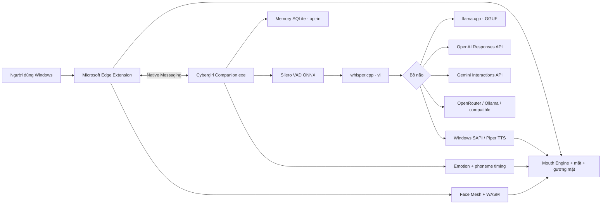

# Cybergirl — Trợ lý ảo tiếng Việt cho Microsoft Edge


[](CHANGELOG.md)
[](.github/workflows/build-windows.yml)
[](https://www.microsoft.com/edge)
[](LICENSE)
[](PRIVACY.md)

**Cybergirl biến một ảnh chân dung thành trợ lý ảo có thể nghe, hiểu, trả lời
và nhép môi bằng tiếng Việt. Người dùng Windows chỉ cài GUI; không phải cài
Python, Node.js hoặc CUDA.**

Cybergirl 3.5 do **Long Ngo** phát triển. Mouth Engine, Face Mesh, ảnh 4K/8K,
mắt và vi chuyển động được giữ lại; Edge Extension nay kết nối companion cục bộ
qua Native Messaging để chạy Silero VAD, Whisper, LLM GGUF và TTS tiếng Việt.

## Nâng cấp 3.5 · Realtime Motion

- Mỗi lượt có `turn_id` và `CancellationToken`; lời nói mới hủy Whisper,
  socket LLM streaming, tiến trình TTS và WAV đang phát của lượt cũ.
- OpenAI Responses, OpenRouter, Ollama và endpoint OpenAI-compatible phát
  `llm.delta`; Gemini vẫn dùng batch nhưng kết quả lượt đã hủy bị loại bỏ.
- Bộ tách câu gửi từng đoạn ngắn sang SAPI/Piper khi LLM còn đang sinh, giảm thời
  gian chờ so với tạo toàn bộ câu trả lời rồi mới tổng hợp.
- Mỗi gói TTS mang `turn_id`, `sequence` và mốc
  `playback_started_unix_ms`; frontend bù độ trễ Native Messaging trước khi
  lấy mẫu timeline viseme.
- Motion Rig bán thân theo vùng ảnh tạo nhịp thở, vai, vùng tay, tóc, trán và mũi;
  cử chỉ `welcome`, `explain`, `point_left/right`, `open_hands` được chọn
  từ ý nghĩa câu trả lời và chạy trên cùng vòng render 30 FPS.
- Ba hồ sơ hiệu năng: Lite chạy CPU, Balanced offload 24 lớp và Pro offload tối
  đa/context 8K. Dashboard hiển thị STT, TTFT, LLM total và first-audio thực đo.
- Bổ sung test cho turn cancellation, sentence chunker, cử chỉ, motion rig và
  đồng bộ phiên bản 3.5.0.

## Nâng cấp 3.4 · Audio-safe Lip Sync

- Tách hai bus tín hiệu: microphone người dùng chỉ cấp meter/VAD; chỉ âm thanh
  đầu ra của Cybergirl hoặc tệp audio chủ động mới được điều khiển miệng.
- Thay toàn bộ timer viseme rời rạc bằng một timeline lấy mẫu trong vòng render,
  có attack/release và tái neo theo `SpeechSynthesisUtterance.boundary`.
- Chuẩn hóa riêng năm dấu thanh tiếng Việt nhưng giữ nguyên `ă/â/ê/ô/ơ/ư`;
  các tiếng như “má”, “mạ”, “ế”, “ứ”, “ở” không còn rơi nhầm về neutral.
- Chặn Speech Recognition ghi đè viseme khi nhân vật đang nói.
- Half-duplex bỏ qua đầu vào trong lúc TTS; full-duplex có thể ngắt ở kết quả
  interim không trùng nội dung loa, thay vì luôn đợi câu final.
- Khôi phục đúng trạng thái microphone sau khi Edge TTS hoặc TTS companion kết thúc.
- Bổ sung test hồi quy cho dấu thanh, một scheduler và phân tách input/output.

## Điểm nổi bật

- Một bộ cài GUI cho Windows 10/11.
- Bố cục tập trung: Avatar ở trên, chat và microphone ngay bên dưới.
- Chat live tiếng Việt: nghe liên tục, tự gửi câu hoàn chỉnh và cho phép ngắt lời.
- Ghi âm trực tiếp tối đa 5 phút, nghe lại và xóa ngay trong bộ nhớ cục bộ.
- Tự mở Microsoft Edge ở chế độ cửa sổ ứng dụng, không hiện cửa sổ lệnh.
- Toàn bộ giao diện, thông báo lỗi và hướng dẫn bằng tiếng Việt.
- Hai đường giọng: Web Speech của Edge hoặc Silero VAD + Whisper cục bộ.
- MediaPipe Face Mesh và hai module WASM chạy cục bộ.
- Mouth Engine 1.4 giữ môi/răng thật, khẩu độ cong và mặt nạ feathered.
- Chọn ảnh, âm thanh, microphone hoặc trò chuyện AI.
- Ba nhân vật tiếng Việt có thể chuyển nóng: Mai, Linh và An.
- Hỗ trợ GGUF/llama.cpp, Ollama, ChatGPT qua OpenAI Responses API, Gemini
  Interactions API, OpenRouter và endpoint tương thích OpenAI.
- OpenRouter dùng Chat Completions, header nhận diện ứng dụng chuẩn
  `X-OpenRouter-Title`, `HTTP-Referer` và tùy chọn Zero Data Retention.
- Benchmark TTS ngay trên máy: thời gian tổng hợp, RTF và ký tự/giây.
- Full-duplex có echo-guard và barge-in; microphone không còn phải đóng khi AI nói.
- Bộ nhớ dài hạn SQLite cục bộ, chỉ hoạt động khi người dùng chủ động bật.
- Emotion Engine tiếng Việt điều khiển gaze, chớp mắt và chuyển động đầu.
- TTS cục bộ trả lịch viseme có timing; text dùng lịch căn chỉnh hữu hạn, audio
  dùng phổ tần thay vì chỉ RMS.
- Registry hồ sơ model/voice và health từng module ngay trên dashboard.
- Quay và xuất WebM trực tiếp từ Canvas; audio Web Audio được ghép khi khả dụng.
- Ảnh, landmark và dữ liệu Face Mesh không được gửi tới API.
- Khóa API chỉ giữ trong RAM và bị xóa khi thoát.
- Tạo ảnh master 7680×4320 ngay trên thiết bị.
- Mã nguồn MIT; icon hồng giúp nhận diện Cybergirl.

## Kiến trúc



### Dòng dữ liệu riêng tư

| Dữ liệu | Xử lý ở đâu | Có gửi tới API AI không? |
|---|---|---|
| Ảnh chân dung | Edge + Canvas + Face Mesh | Không |
| Landmark môi/mắt/mặt | Bộ nhớ trình duyệt | Không |
| Microphone | Edge hoặc companion cục bộ | Không, nếu chọn Whisper cục bộ |
| Văn bản câu hỏi | Companion | Có, chỉ khi chọn OpenAI/Gemini/OpenRouter/API từ xa |
| Câu trả lời | Companion → Edge/TTS cục bộ | Có ở nhà cung cấp đã chọn |
| Khóa API | RAM của companion | Chỉ gửi tới nhà cung cấp đã chọn |
| Bộ nhớ dài hạn | SQLite cục bộ, mặc định tắt | Không |

## Đối chiếu 30 khối: bản 3.3 → 3.5

Điểm 7–9/10 dưới đây là **mức kiến trúc/mục tiêu nghiệm thu**, không phải số
benchmark dựng sẵn. Dashboard 3.5 ghi thời gian thật trên máy người dùng.

| # | Khối | Cybergirl 3.3 | Cybergirl 3.5 | Mức hiện tại |
|---:|---|---|---|---|
| 1 | VAD và endpoint | Silero cắt câu | Giữ Silero, echo-guard và hủy lượt ngay khi speech-start | 8/10 · đã mã hóa |
| 2 | STT tiếng Việt | Whisper trên WAV hoàn chỉnh | Whisper hủy được bằng Popen; báo `stt_ms` | 7/10 · còn batch theo phát ngôn |
| 3 | LLM | Chờ toàn bộ JSON | SSE/JSONL cho OpenAI, OpenRouter, Ollama, compatible | 8/10 · cần benchmark model |
| 4 | Token đầu tiên | Không hiển thị | `llm.delta` và `llm_ttft_ms` | 8/10 · đã mã hóa |
| 5 | Điều phối lượt | Trạng thái rời rạc | Một `TurnCoordinator`, ID tăng đơn điệu | 9/10 · đã test |
| 6 | Ngắt lời hoàn chỉnh | Chủ yếu dừng TTS | Hủy STT, đóng LLM stream, dừng synth/playback, loại kết quả cũ | 8/10 · Gemini batch là best-effort |
| 7 | TTS | Tạo toàn bộ WAV trả lời | Tách câu streaming, synth/phát tuần tự khi LLM còn chạy | 7/10 · chưa streaming PCM |
| 8 | First-audio | Không đo | Ghi `first_audio_ms` theo từng turn | 8/10 · đo trên máy thật |
| 9 | Engine giọng | Edge/SAPI/Piper | Giữ fallback, tiến trình SAPI/Piper hủy được | 8/10 |
| 10 | Đồng hồ lip-sync | Timer/timeline tương đối | Bù trễ bằng mốc phát native + timeline frame-sampled | 7/10 · chưa sample clock |
| 11 | Lip-sync text Edge | Ước lượng ký tự | G2P tiếng Việt + boundary re-anchor | 7/10 · giới hạn Web Speech |
| 12 | Lip-sync WAV/audio | RMS cơ bản | RMS + phổ ba dải + viseme theo thời lượng thật | 8/10 |
| 13 | Coarticulation | Chuyển khẩu hình cứng | Attack/release và nội suy viseme kế tiếp | 8/10 |
| 14 | Miệng | Biến dạng mảnh ảnh | Khẩu độ cong, khoang tối thích nghi, mask feathered | 8/10 |
| 15 | Mắt và gaze | Chớp cơ bản | Gaze theo phase/emotion, dịch mống mắt cục bộ | 8/10 |
| 16 | Chớp mắt | Chu kỳ đơn | Chớp đơn/kép, tần suất theo cảm xúc | 8/10 |
| 17 | Mũi | Đứng yên | Vi dịch theo thở và motion strength | 7/10 · procedural |
| 18 | Trán | Đứng yên | Vùng trán co giãn rất nhẹ theo chu kỳ | 7/10 · procedural |
| 19 | Tóc | Đi cùng toàn ảnh | Lớp tóc dao động riêng, biên độ thấp | 7/10 · phụ thuộc ảnh |
| 20 | Thân/ngực | Đi cùng toàn ảnh | Chu kỳ thở và scale dọc vùng thân | 7/10 · procedural |
| 21 | Vai | Đứng yên | Vai xoay/nghiêng theo nghe, nói và cử chỉ | 7/10 |
| 22 | Tay/bàn tay | Không có hệ thống tay | Hai vùng tay quay quanh vai nếu tay hiện diện trong ảnh | 7/10 với ảnh bán thân; không sinh tay mới |
| 23 | Cử chỉ ngữ nghĩa | Không có | welcome, explain, point, open-hands, listen | 8/10 · rule-based |
| 24 | Emotion → animation | Gaze/blink/head | Thêm gesture, vai, tóc, thân và cường độ | 8/10 |
| 25 | Full duplex | Mic và TTS dễ tranh chấp | Input/output bus riêng, barge-in theo turn | 8/10 |
| 26 | Chống vọng | So khớp văn bản đơn giản | VAD threshold động + lọc echo Edge | 7/10 · chưa AEC phần cứng |
| 27 | Bộ nhớ | RAM | 24 lượt RAM + SQLite opt-in có truy hồi | 8/10 |
| 28 | Hiệu năng GGUF | CPU mặc định | Lite/Balanced/Pro; `-ngl` 0/24/99, context 4K/8K | 8/10 · tùy binary/GPU |
| 29 | Chẩn đoán | Health module | Health + STT/TTFT/LLM/first-audio theo turn | 8/10 |
| 30 | Đóng gói và riêng tư | Windows/Edge local | CI 3.5, EXE/ZIP/installer; ảnh và landmark không ra API | 9/10 · chờ CI mới |


Web Speech do Edge/Windows cung cấp; tùy cấu hình hệ điều hành, nhận dạng giọng
có thể dùng dịch vụ của Microsoft. Xem [chính sách riêng tư](PRIVACY.md).

## Giới hạn kiến trúc được công bố rõ

- Motion Rig 3.5 là biến dạng vùng ảnh có biên độ thấp, không phải skeleton 3D.
  Tay chỉ chuyển động nếu ảnh nguồn đã chứa vai/cánh tay/bàn tay; hệ thống không
  dựng phần cơ thể bị che hoặc tạo bàn tay mới.
- TTS local đã bắt đầu theo từng câu trong lúc LLM streaming nhưng SAPI/Piper vẫn
  tạo WAV cho từng đoạn. Streaming PCM/AudioWorklet ring buffer là bước Pro tiếp theo.
- Mốc phát native giúp bù trễ Native Messaging nhưng chưa phải bộ đếm
  `playedSamples / sampleRate`. Vì vậy chưa cam kết P95 lip-sync dưới 80 ms.
- Microsoft Hoài My qua Web Speech không trả PCM, phoneme hoặc AudioNode; chế độ
  Edge vẫn là căn chỉnh gần đúng bằng boundary.
- OpenAI/OpenRouter/Ollama/compatible có thể đóng stream khi ngắt lời. Gemini
  Interactions hiện là batch: Cybergirl loại kết quả cũ sau khi request trở về,
  nhưng không đảm bảo dừng tính toán phía máy chủ.
- Hồ sơ Pro chỉ có hiệu lực khi `llama-server.exe` được build với CUDA, HIP hoặc
  Vulkan tương thích. Nếu không, hãy dùng Lite hoặc Balanced.

### Mục tiêu nghiệm thu 7–9/10

| Chỉ số | Ngưỡng mục tiêu |
|---|---:|
| Tắt loa sau barge-in | P95 ≤ 150 ms |
| LLM time-to-first-token local | P95 ≤ 450 ms |
| First audio sau STT final | P95 ≤ 1.000 ms |
| Lệch môi native wall-clock | P95 ≤ 120 ms |
| Frame time Motion Rig ở 30 FPS | P95 ≤ 33 ms |
| Cử chỉ bám câu khóa | ±200 ms từ lúc đoạn TTS tương ứng bắt đầu |


## Cài trên Windows

### Cách một — Bộ cài GUI

1. Mở mục **Actions** hoặc **Releases** của repository.
2. Tải `Cybergirl-Setup-v3.5.0-Windows-x64.exe`.
3. Chạy bộ cài và chọn tạo biểu tượng ngoài màn hình.
4. Bộ cài tự đăng ký `vn.base27.cybergirl` trong Native Messaging của Edge.
5. Mở `edge://extensions`, bật chế độ nhà phát triển và tải thư mục
   `Extension` nằm trong thư mục cài đặt Cybergirl nếu extension chưa được cài.
6. Cho phép microphone khi Cybergirl hỏi.

Người dùng cuối không cần cài Python, Node.js, CUDA hoặc Face Mesh riêng.

### Cách hai — Extension dành cho phát triển

1. Tải repository và giải nén.
2. Mở `edge://extensions`.
3. Bật **Chế độ nhà phát triển**.
4. Chọn **Tải tiện ích đã giải nén**.
5. Chọn thư mục chứa `manifest.json`.

Extension độc lập vẫn dùng ảnh, Face Mesh, Web Speech và nhép môi. Silero,
Whisper, GGUF và TTS cục bộ cần `Cybergirl-Companion.exe` cùng Native Host đã
được đăng ký.

## Chọn bộ não AI

### GGUF cục bộ — mặc định

Phù hợp máy Windows RAM 16 GB: chọn một mô hình hướng dẫn 3–4B lượng tử Q4,
`llama-server.exe` và tệp `.gguf`. Companion tự khởi động server chỉ trên
`127.0.0.1:27829`.

### ChatGPT qua OpenAI API

```text
Nhà cung cấp: ChatGPT · OpenAI Responses API
Địa chỉ API: https://api.openai.com/v1
Mô hình mặc định: gpt-5.6-sol
```

Cybergirl dùng Responses API ở chế độ `store: false`. Khóa API nhập trong
dashboard chỉ giữ trong RAM. Người dùng vẫn có thể thay model theo quyền của tài
khoản.

Gói thuê bao ChatGPT và khóa OpenAI API là hai dịch vụ riêng. Chế độ này cần
khóa của OpenAI Platform; Cybergirl không đọc phiên đăng nhập ChatGPT trong Edge.

### Ollama cục bộ

Phù hợp máy Windows RAM 16 GB, không cần khóa API:

```powershell
ollama pull qwen3:4b
```

Trong Cybergirl chọn:

```text
Nhà cung cấp: Ollama cục bộ
Địa chỉ API: http://127.0.0.1:11434
Mô hình: qwen3:4b
```

Cybergirl không tự cài Ollama. Nếu không muốn cài thêm mô hình, hãy dùng Gemini
hoặc một API tương thích OpenAI.

### Google Gemini

```text
Nhà cung cấp: Google Gemini API
Địa chỉ API: https://generativelanguage.googleapis.com/v1
Mô hình mặc định: gemini-3.6-flash
Khóa API: nhập cho phiên hiện tại
```

### OpenRouter

OpenRouter cho phép dùng nhiều mô hình qua một endpoint tương thích OpenAI.
Thiết lập mặc định của Cybergirl:

```text
Nhà cung cấp: OpenRouter · nhiều mô hình AI
Địa chỉ API: https://openrouter.ai/api/v1
Mô hình: openai/gpt-4o
HTTP-Referer: https://github.com/Base27-CVNSS/Avatar
Tên ứng dụng: Cybergirl
Khóa API: nhập một khóa mới cho phiên hiện tại
```

Cybergirl gửi yêu cầu tới `/chat/completions` qua companion cục bộ, không để
khóa trong mã JavaScript của extension. Khóa chỉ nằm trong RAM và bị xóa khi
thoát. `X-OpenRouter-Title` là header tên ứng dụng hiện hành; `X-Title` cũ không
được gửi. Có thể bật **Chỉ định tuyến Zero Data Retention** nếu tài khoản và nhà
cung cấp model hỗ trợ. Không commit, chụp màn hình hoặc dán khóa thật vào issue.

### API tương thích OpenAI

Áp dụng cho llama.cpp, vLLM, LM Studio, Ollama `/v1` hoặc nhà cung cấp khác:

```text
Địa chỉ API: http://127.0.0.1:11434/v1
Mô hình: qwen3:4b
Khóa API: để trống nếu máy chủ cục bộ không yêu cầu
```

Cybergirl không khóa cứng tên mô hình. Hãy nhập tên mà endpoint của bạn cung cấp.

## Hội thoại giọng nói

1. Chọn ảnh và chờ Face Mesh nhận diện; Avatar luôn nằm ở sân khấu phía trên.
2. Chọn nhân vật và cấu hình API trong bảng thiết lập phía dưới.
3. Bấm **Kiểm tra API**.
4. Trong dock dưới Avatar, bấm **Bắt đầu Chat live**. Cybergirl tự bật chế độ
   hội thoại liên tục, nhận câu tiếng Việt hoàn chỉnh và gửi tới bộ não AI.
5. Có thể bấm **Ghi âm** để lưu một bản ghi cục bộ tối đa 5 phút. Bản ghi không
   được upload; khi nghe lại, phổ âm thanh thật điều khiển khẩu hình.
6. Trong **Thiết lập companion cục bộ**, chọn Silero ONNX,
   `whisper-cli.exe` và model Whisper đa ngôn ngữ.
7. Silero cắt câu, Whisper phiên âm cục bộ, bộ não trả lời và TTS phát giọng;
   Mouth Engine nhận sự kiện để đồng bộ môi, mắt và gương mặt.
8. Có thể bật **Bộ nhớ dài hạn cục bộ**; dữ liệu chỉ nằm trong SQLite trên PC
   và có nút xóa riêng.

Bạn cũng có thể nhập câu hỏi rồi bấm **Gửi và trả lời** hoặc `Ctrl+Enter`.

Silero và model Whisper mẫu có thể tải chủ động bằng
[`models/tai-model-giong-noi.ps1`](models/tai-model-giong-noi.ps1). Binary
whisper.cpp, llama.cpp, LLM GGUF và voice Piper không được tự tải/cài ngầm.

## Nhân vật

`characters.json` kế thừa ý tưởng registry trong mã nguồn người dùng:

```json
{
  "mai": {
    "label": "Mai · Dịu dàng",
    "llm_model": "qwen3:4b",
    "voice_language": "vi-VN",
    "system_prompt": "Prompt tiếng Việt..."
  }
}
```

`voice_registry.py` kiểm tra JSON, giới hạn prompt, chuyển nhân vật an toàn luồng
và không gửi system prompt xuống giao diện.

## TTS tiếng Việt có benchmark

Dashboard có nút **Benchmark TTS**. Cùng một câu được tổng hợp bằng Windows SAPI
và Piper/VITS nếu khả dụng. Báo cáo gồm:

- thời gian tạo WAV;
- thời lượng âm thanh;
- RTF — nhỏ hơn một nghĩa là tổng hợp nhanh hơn thời gian phát;
- số ký tự xử lý mỗi giây.

Kết quả được đo trên chính máy người dùng, không dùng số liệu dựng sẵn. Xem
[`benchmarks`](benchmarks) và [`companion`](companion).

### Qwen3-TTS thử nghiệm

Mã thử nghiệm của người dùng đã được cập nhật trong
[`tuy-chon-qwen3`](tuy-chon-qwen3). Thành phần này không nằm trong EXE mặc định:

- Qwen3-TTS/PyTorch làm gói nặng và không phù hợp yêu cầu chỉ cài GUI.
- Máy AMD không hưởng lợi từ đường CUDA của mã cũ.
- Tiếng Việt chưa nằm trong danh sách hỗ trợ chính thức của Qwen3-TTS.

Bản ổn định ưu tiên giọng Việt sẵn có trong Microsoft Edge/Windows.

## Bảo mật cổng API

- Chỉ lắng nghe trên `127.0.0.1`.
- Tự chọn cổng từ 27827 đến 27838 nếu cổng mặc định đang bận.
- Mỗi phiên tạo một token ngẫu nhiên 256 bit.
- Mọi POST API phải có `X-Cybergirl-Token`.
- Kiểm tra `Origin`, giới hạn JSON một MB và không bật CORS.
- Chính sách CSP chặn script, frame và object từ ngoài.
- Không ghi khóa API vào `localStorage`, `chrome.storage` hoặc tệp cấu hình.

## Đóng gói Windows

GitHub Actions tự tạo:

- `Cybergirl-Windows-x64.exe` — GUI một tệp.
- `Cybergirl-Companion.exe` — Native Messaging host.
- `Cybergirl-Edge-v3.5.0.zip` — extension có ID ổn định.
- `Cybergirl-Setup-v3.5.0-Windows-x64.exe` — bộ cài Inno Setup tiếng Việt.

Tự build trên Windows:

```powershell
python -m pip install -r requirements-build.txt
npm test
pyinstaller --noconfirm --clean cybergirl.spec
pyinstaller --noconfirm --clean cybergirl_companion.spec
```

Sau đó dùng Inno Setup 6 biên dịch `installer/Cybergirl.iss`.

## Kiểm thử

```powershell
npm test
python cybergirl.py --tu-kiem-tra
```

Bộ kiểm thử xác thực:

- Manifest V3 chỉ dùng `storage`, `nativeMessaging`, không có host permission.
- Ảnh runtime 3840×2160 và xuất master 7680×4320.
- Face Mesh, model data và hai WASM hợp lệ.
- Mouth Engine không tái xuất hiện dải màu khoang miệng cố định.
- Registry nhân vật tiếng Việt.
- Native protocol, Silero/Whisper/GGUF/TTS component matrix.
- Memory SQLite opt-in, Emotion Engine và phoneme timing.
- Full-duplex echo-guard, model registry và xuất WebM.
- GUI Avatar-trên/chat-dưới, Chat live và ghi âm MediaRecorder cục bộ.
- Text-aligned viseme, trạng thái hội thoại và motion theo ngữ cảnh.
- Adapter GGUF, Ollama, OpenAI Responses, Gemini Interactions, OpenRouter và compatible.
- OpenRouter attribution, ZDR routing và kiểm tra chống rò rỉ khóa.
- Token bảo vệ cổng vòng lặp.
- Khóa API không bị ghi xuống ổ đĩa.
- Thành phần bộ cài GUI Windows.

## Cấu trúc

```text
Avatar/
├── cybergirl.py                 # GUI, máy chủ vòng lặp và bộ mở Edge
├── api_client.py                # GGUF/Ollama/OpenAI/Gemini/OpenRouter/compatible
├── cybergirl_native_host.py     # Điểm vào companion EXE
├── companion/                   # VAD, Whisper, LLM, TTS, benchmark
├── native-host/                 # Manifest và đăng ký Edge HKCU
├── models/                      # Hướng dẫn model; không lưu binary vào Git
├── benchmarks/                  # Phương pháp benchmark có thể kiểm chứng
├── voice_registry.py            # Registry nhân vật
├── characters.json              # Nhân vật tiếng Việt
├── index.html
├── styles.css
├── app.js                       # Face Mesh, mouth engine, giọng và chat
├── manifest.json                # Extension Edge MV3
├── cybergirl.spec               # Đóng gói PyInstaller
├── cybergirl_companion.spec     # Đóng gói Native Messaging host
├── installer/Cybergirl.iss      # Bộ cài tiếng Việt
├── tuy-chon-qwen3/              # Tích hợp TTS thử nghiệm, không đóng gói
├── assets/
├── vendor/face_mesh/
├── icons/
├── tests/
└── .github/workflows/build-windows.yml
```

## Giấy phép

Mã Cybergirl phát hành theo [MIT License](LICENSE). Phát triển bởi **Long Ngo**.
MediaPipe Face Mesh và các thành phần đóng gói có giấy phép riêng được ghi trong
[THIRD_PARTY_NOTICES.md](THIRD_PARTY_NOTICES.md).
