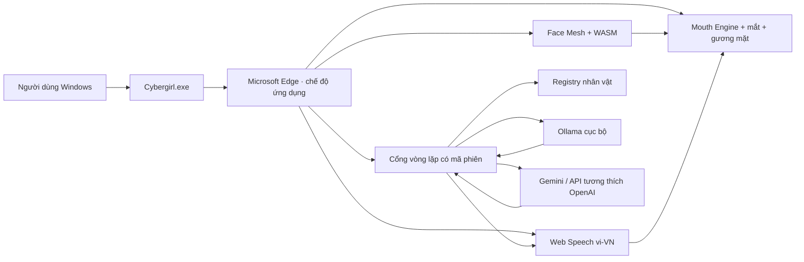

# Cybergirl — Trợ lý ảo tiếng Việt cho Microsoft Edge


[](CHANGELOG.md)
[](.github/workflows/build-windows.yml)
[](https://www.microsoft.com/edge)
[](LICENSE)
[](PRIVACY.md)

**Cybergirl biến một ảnh chân dung thành trợ lý ảo có thể nghe, hiểu, trả lời
và nhép môi bằng tiếng Việt. Người dùng Windows chỉ cài GUI; không phải cài
Python, Node.js hoặc CUDA.**

Cybergirl 2.0 do **Long Ngo** phát triển từ Avatar VN 1.4. Mouth Engine, Face
Mesh, ảnh 4K/8K, mắt và vi chuyển động được giữ lại; vòng hội thoại AI, registry
nhân vật, GUI Windows và cổng API được bổ sung mới.

## Điểm nổi bật

- Một bộ cài GUI cho Windows 10/11.
- Tự mở Microsoft Edge ở chế độ cửa sổ ứng dụng, không hiện cửa sổ lệnh.
- Toàn bộ giao diện, thông báo lỗi và hướng dẫn bằng tiếng Việt.
- Nhận giọng `vi-VN` và phát giọng Việt qua Web Speech API của Edge.
- MediaPipe Face Mesh và hai module WASM chạy cục bộ.
- Mouth Engine 1.4 giữ môi/răng thật, khẩu độ cong và mặt nạ feathered.
- Chọn ảnh, âm thanh, microphone hoặc trò chuyện AI.
- Ba nhân vật tiếng Việt có thể chuyển nóng: Mai, Linh và An.
- Hỗ trợ Ollama cục bộ, Gemini và mọi API tương thích OpenAI.
- Ảnh, landmark và dữ liệu Face Mesh không được gửi tới API.
- Khóa API chỉ giữ trong RAM và bị xóa khi thoát.
- Tạo ảnh master 7680×4320 ngay trên thiết bị.
- Mã nguồn MIT; icon hồng giúp nhận diện Cybergirl.

## Kiến trúc



### Dòng dữ liệu riêng tư

| Dữ liệu | Xử lý ở đâu | Có gửi tới API AI không? |
|---|---|---|
| Ảnh chân dung | Edge + Canvas + Face Mesh | Không |
| Landmark môi/mắt/mặt | Bộ nhớ trình duyệt | Không |
| Microphone | Edge/Web Speech | Không do mã Cybergirl chủ động gửi |
| Văn bản câu hỏi | Cổng API vòng lặp | Có, nếu chọn API từ xa |
| Câu trả lời | API → Edge TTS | Có |
| Khóa API | RAM của `Cybergirl.exe` | Chỉ gửi tới nhà cung cấp đã chọn |

Web Speech do Edge/Windows cung cấp; tùy cấu hình hệ điều hành, nhận dạng giọng
có thể dùng dịch vụ của Microsoft. Xem [chính sách riêng tư](PRIVACY.md).

## Cài trên Windows

### Cách một — Bộ cài GUI

1. Mở mục **Actions** hoặc **Releases** của repository.
2. Tải `Cybergirl-Setup-v2.0.0-Windows-x64.exe`.
3. Chạy bộ cài và chọn tạo biểu tượng ngoài màn hình.
4. Mở **Cybergirl**. Bảng điều khiển nhỏ xuất hiện và Edge tự mở giao diện chính.
5. Cho phép microphone khi Edge hỏi.

Người dùng cuối không cần cài Python, Node.js, CUDA hoặc Face Mesh riêng.

### Cách hai — Extension dành cho phát triển

1. Tải repository và giải nén.
2. Mở `edge://extensions`.
3. Bật **Chế độ nhà phát triển**.
4. Chọn **Tải tiện ích đã giải nén**.
5. Chọn thư mục chứa `manifest.json`.

Extension độc lập vẫn dùng ảnh, Face Mesh, TTS/STT và nhép môi. Hội thoại AI
chỉ hoạt động đầy đủ khi mở bằng GUI Windows, vì cổng API được bảo vệ bằng mã
phiên tạo riêng ở mỗi lần chạy.

## Chọn bộ não AI

### Ollama cục bộ — mặc định

Phù hợp máy Windows RAM 16 GB, không cần khóa API:

```powershell
ollama pull qwen3:4b
```

Trong Cybergirl chọn:

```text
Nhà cung cấp: Ollama cục bộ
Địa chỉ API: http://127.0.0.1:11434
Mô hình: qwen3:4b
```

Cybergirl không tự cài Ollama. Nếu không muốn cài thêm mô hình, hãy dùng Gemini
hoặc một API tương thích OpenAI.

### Google Gemini

```text
Nhà cung cấp: Google Gemini
Địa chỉ API: https://generativelanguage.googleapis.com/v1beta
Mô hình: tên mô hình Gemini tài khoản của bạn đang được phép sử dụng
Khóa API: nhập cho phiên hiện tại
```

### API tương thích OpenAI

Áp dụng cho llama.cpp, vLLM, LM Studio, Ollama `/v1` hoặc nhà cung cấp khác:

```text
Địa chỉ API: http://127.0.0.1:11434/v1
Mô hình: qwen3:4b
Khóa API: để trống nếu máy chủ cục bộ không yêu cầu
```

Cybergirl không khóa cứng tên mô hình. Hãy nhập tên mà endpoint của bạn cung cấp.

## Hội thoại giọng nói

1. Chọn ảnh và chờ Face Mesh nhận diện.
2. Chọn nhân vật và cấu hình API.
3. Bấm **Kiểm tra API**.
4. Bật **Hội thoại giọng nói liên tục**.
5. Mở thẻ **Microphone** và bấm **Bắt đầu nhận giọng Việt**.
6. Khi Edge xác nhận câu nói, Cybergirl tự gửi văn bản tới AI.
7. Câu trả lời được đọc bằng voice `vi-VN`; khẩu hình tự đồng bộ và microphone
   mở lại sau khi nói xong.

Bạn cũng có thể nhập câu hỏi rồi bấm **Gửi và trả lời** hoặc `Ctrl+Enter`.

## Nhân vật

`characters.json` kế thừa ý tưởng registry trong mã nguồn người dùng:

```json
{
  "mai": {
    "label": "Mai · Dịu dàng",
    "llm_model": "qwen3:4b",
    "voice_language": "vi-VN",
    "system_prompt": "Prompt tiếng Việt..."
  }
}
```

`voice_registry.py` kiểm tra JSON, giới hạn prompt, chuyển nhân vật an toàn luồng
và không gửi system prompt xuống giao diện.

## Qwen3-TTS

Mã thử nghiệm của người dùng đã được cập nhật trong
[`tuy-chon-qwen3`](tuy-chon-qwen3). Thành phần này không nằm trong EXE mặc định:

- Qwen3-TTS/PyTorch làm gói nặng và không phù hợp yêu cầu chỉ cài GUI.
- Máy AMD không hưởng lợi từ đường CUDA của mã cũ.
- Tiếng Việt chưa nằm trong danh sách hỗ trợ chính thức của Qwen3-TTS.

Bản ổn định ưu tiên giọng Việt sẵn có trong Microsoft Edge/Windows.

## Bảo mật cổng API

- Chỉ lắng nghe trên `127.0.0.1`.
- Tự chọn cổng từ 27827 đến 27838 nếu cổng mặc định đang bận.
- Mỗi phiên tạo một token ngẫu nhiên 256 bit.
- Mọi POST API phải có `X-Cybergirl-Token`.
- Kiểm tra `Origin`, giới hạn JSON một MB và không bật CORS.
- Chính sách CSP chặn script, frame và object từ ngoài.
- Không ghi khóa API vào `localStorage`, `chrome.storage` hoặc tệp cấu hình.

## Đóng gói Windows

GitHub Actions tự tạo:

- `Cybergirl-Windows-x64.exe` — GUI một tệp.
- `Cybergirl-Setup-v2.0.0-Windows-x64.exe` — bộ cài Inno Setup tiếng Việt.

Tự build trên Windows:

```powershell
python -m pip install -r requirements-build.txt
npm test
pyinstaller --noconfirm --clean cybergirl.spec
```

Sau đó dùng Inno Setup 6 biên dịch `installer/Cybergirl.iss`.

## Kiểm thử

```powershell
npm test
python cybergirl.py --tu-kiem-tra
```

Bộ kiểm thử xác thực:

- Manifest V3 và không có host permission.
- Ảnh runtime 3840×2160 và xuất master 7680×4320.
- Face Mesh, model data và hai WASM hợp lệ.
- Mouth Engine không tái xuất hiện dải màu khoang miệng cố định.
- Registry nhân vật tiếng Việt.
- Ba adapter Ollama, Gemini và OpenAI-compatible.
- Token bảo vệ cổng vòng lặp.
- Khóa API không bị ghi xuống ổ đĩa.
- Thành phần bộ cài GUI Windows.

## Cấu trúc

```text
Avatar/
├── cybergirl.py                 # GUI, máy chủ vòng lặp và bộ mở Edge
├── api_client.py                # Ollama, Gemini, OpenAI-compatible
├── voice_registry.py            # Registry nhân vật
├── characters.json              # Nhân vật tiếng Việt
├── index.html
├── styles.css
├── app.js                       # Face Mesh, mouth engine, giọng và chat
├── manifest.json                # Extension Edge MV3
├── cybergirl.spec               # Đóng gói PyInstaller
├── installer/Cybergirl.iss      # Bộ cài tiếng Việt
├── tuy-chon-qwen3/              # Tích hợp TTS thử nghiệm, không đóng gói
├── assets/
├── vendor/face_mesh/
├── icons/
├── tests/
└── .github/workflows/build-windows.yml
```

## Giấy phép

Mã Cybergirl phát hành theo [MIT License](LICENSE). Phát triển bởi **Long Ngo**.
MediaPipe Face Mesh và các thành phần đóng gói có giấy phép riêng được ghi trong
[THIRD_PARTY_NOTICES.md](THIRD_PARTY_NOTICES.md).
