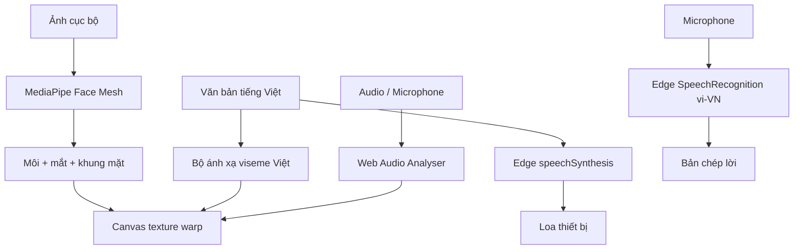

# Avatar VN — Edge Talking Photo


**Tạo ảnh biết nói bằng giọng Việt ngay trong Microsoft Edge — không API key, không backend riêng, không tải ảnh/tệp lên máy chủ của extension.**

[](https://www.microsoft.com/edge)
[](manifest.json)
[](LICENSE)
[](PRIVACY.md)

Avatar VN là Microsoft Edge Extension mã nguồn mở do **Long Ngo** phát triển. Phiên bản 1.1 nhận diện landmark của môi, hai mắt và khung mặt trên ảnh upload bằng MediaPipe Face Mesh chạy cục bộ, sau đó dựng chuyển động mềm bằng Web Speech API, Web Audio API và Canvas 2D. Phần ảnh, Face Mesh, Canvas và phân tích tệp audio chạy trên thiết bị; dịch vụ TTS/STT cụ thể do Edge/Windows cung cấp và có thể dùng xử lý trực tuyến tùy voice, phiên bản và cấu hình hệ thống.

> Bản này được tái cấu trúc từ ý tưởng của ứng dụng `lip-sync-ai-main`. Mã gốc tải ảnh/âm thanh lên fal.ai và gọi OmniHuman 1.5 ở backend. Avatar VN loại bỏ toàn bộ Next.js server, `FAL_KEY`, lưu trữ đám mây và API sinh video.

## Điểm nổi bật

- Chọn hoặc kéo thả ảnh JPG, PNG, WebP và GIF.
- Tự nhận diện hàng trăm landmark để định vị môi, mắt và tỷ lệ mặt.
- Không dùng lại tọa độ miệng của ảnh trước cho ảnh mới.
- Chế độ hiệu chỉnh dự phòng 5 điểm: hai mắt, hai khóe miệng và tâm môi.
- Biến dạng mềm giữ texture môi gốc; không vẽ oval đen hoặc răng giả đè lên ảnh.
- Chớp mắt ngẫu nhiên và vi chuyển động đầu ở biên độ thấp.
- Tự ưu tiên giọng `vi-VN` có sẵn trong Microsoft Edge/Windows.
- Đọc văn bản tiếng Việt và tạo viseme gần đúng theo nguyên âm/phụ âm.
- Chèn tệp MP3, WAV, M4A, OGG hoặc WebM; khẩu hình bám theo biên độ âm thanh thật.
- Nhận giọng Việt qua `SpeechRecognition`, hiển thị cả kết quả tạm thời và chính thức.
- Microphone điều khiển môi theo âm lượng thực, có khử vọng và giảm nhiễu của trình duyệt.
- Dashboard responsive, chạy trực tiếp trong extension.
- Chụp khung hình nhân vật thành PNG.
- Không host permission, không analytics, không cookie, không API key hay server do người dùng phải cài.

## Kiến trúc



| Thành phần | API trình duyệt | Vai trò |
|---|---|---|
| Ảnh | `File`, `ObjectURL`, Canvas 2D | Đọc ảnh và dựng nhân vật cục bộ |
| Landmark | MediaPipe Face Mesh + WASM | Định vị môi, mắt và tỷ lệ khuôn mặt |
| Phát giọng | `speechSynthesis` | Dùng voice tiếng Việt có sẵn trong Edge/Windows |
| Nhận giọng | `SpeechRecognition` / `webkitSpeechRecognition` | Chuyển lời nói thành văn bản `vi-VN` |
| Lip-sync TTS | Bộ viseme JavaScript | Ước lượng khẩu hình từ ký tự/âm tiết tiếng Việt |
| Lip-sync audio | `AudioContext`, `AnalyserNode` | Đo RMS âm thanh theo từng khung hình |
| Giao diện | HTML, CSS, JavaScript thuần | Không bundler, không framework, không phụ thuộc npm |

## Cài trên Microsoft Edge

1. Tải repository bằng **Code → Download ZIP** và giải nén.
2. Mở `edge://extensions`.
3. Bật **Developer mode / Chế độ nhà phát triển**.
4. Chọn **Load unpacked / Tải tiện ích đã giải nén**.
5. Chọn thư mục chứa `manifest.json`.
6. Ghim **Avatar VN** lên thanh công cụ và bấm icon để mở studio.

## Sử dụng

1. Chọn ảnh chân dung chính diện; Face Mesh sẽ tự động chạy.
2. Kiểm tra khung hướng dẫn màu xanh trên mắt và miệng. Nếu nhận diện chưa đúng, bấm **Chỉnh 5 điểm** và lần lượt đặt hai mắt, hai khóe miệng, tâm môi.
3. Chọn một trong ba nguồn:
   - **Văn bản:** chọn voice tiếng Việt, chỉnh tốc độ/cao độ, bấm **Phát và nhép môi**.
   - **Âm thanh:** chọn tệp và bấm Play trên trình phát.
   - **Microphone:** bấm **Bắt đầu nhận giọng Việt** rồi cho phép Edge dùng mic.
4. Điều chỉnh **Độ mở khẩu hình** và **Vi chuyển động gương mặt** ở mức vừa phải; 55–75% thường tự nhiên nhất.
5. Bấm **Chụp PNG** để lưu khung hình hiện tại.

## Cài giọng Việt cho Edge/Windows

Nếu danh sách không có giọng `vi-VN`:

1. Mở **Windows Settings → Time & language → Language & region**.
2. Thêm **Vietnamese / Tiếng Việt**.
3. Trong **Speech**, cài gói giọng đọc tiếng Việt nếu phiên bản Windows cung cấp.
4. Khởi động lại Edge và mở lại extension.

Tên voice phụ thuộc phiên bản Windows/Edge. Mã không khóa cứng tên giọng mà tự ưu tiên mọi voice có mã ngôn ngữ bắt đầu bằng `vi`.

## Khác gì OmniHuman/Wav2Lip?

Avatar VN ưu tiên **không server và phản hồi tức thì**. Đây là engine Canvas thời gian thực, không phải mô hình neural video generation.

| Tiêu chí | Avatar VN | OmniHuman/Wav2Lip trên GPU |
|---|---|---|
| Cần server/GPU | Không | Có |
| API key/quota | Không | Thường có |
| Phản hồi | Thời gian thực | Phải render |
| Dữ liệu rời thiết bị | Không | Có thể có |
| Độ quang thực | Tốt cho preview/nhân vật tương tác | Cao hơn rõ rệt |
| Xuất video neural | Không | Có |

Không nên mô tả Avatar VN là mô hình AI sinh video quang thực. Ứng dụng phù hợp với trợ lý ảo, demo kiosk, lớp học, prototype hội thoại và trải nghiệm riêng tư trên thiết bị. Ảnh chính diện, khuôn mặt lớn và hiệu chỉnh miệng đúng vị trí sẽ cho kết quả tốt nhất.

## Quyền và riêng tư

Manifest chỉ yêu cầu:

```json
{
  "permissions": ["storage"]
}
```

`storage` chỉ lưu cường độ khẩu hình, vi chuyển động, tốc độ và cao độ. Landmark không được tái sử dụng giữa các ảnh. Ảnh và audio được mở qua Object URL trong phiên hiện tại. Quyền microphone chỉ xuất hiện khi người dùng chủ động bấm bắt đầu. `SpeechRecognition` có thể dùng dịch vụ giọng nói của Microsoft, tùy cấu hình Edge/Windows; mã extension không tự gửi dữ liệu tới endpoint nào. Xem [PRIVACY.md](PRIVACY.md).

## Cấu trúc mã nguồn

```text
Avatar/
├── manifest.json
├── background.js
├── index.html
├── styles.css
├── app.js
├── assets/
│   └── demo-avatar.svg
├── vendor/
│   └── face_mesh/       # MediaPipe JS, model data và WASM cục bộ
├── icons/
│   ├── logo.svg
│   ├── icon16.png
│   ├── icon32.png
│   ├── icon48.png
│   └── icon128.png
├── PRIVACY.md
├── THIRD_PARTY_NOTICES.md
├── LICENSE
└── README.md
```

## Phát triển

Không cần `npm install`.

- Sửa `index.html`, `styles.css` hoặc `app.js`.
- Mở `edge://extensions`.
- Bấm **Reload** trên thẻ Avatar VN.
- Bấm icon extension để mở phiên bản mới.

Hãy chạy bằng **Load unpacked** trong `edge://extensions`. Khi mở trực tiếp qua `file://`, Edge có thể chặn việc nạp WASM/model; lúc đó dashboard vẫn hoạt động nhưng nhận diện tự động sẽ chuyển sang hiệu chỉnh 5 điểm. Microphone/STT cũng cần secure context (`https://`, `localhost` hoặc trang extension).

## Kiểm tra nhanh

```bash
node --check app.js
node --check background.js
python -m json.tool manifest.json
```

## Lộ trình

- Bộ viseme tiếng Việt theo âm vị chính xác hơn.
- Ghi WebM cục bộ từ Canvas + audio do người dùng tải lên.
- Nhiều preset biểu cảm và cử động đầu.
- Tùy chọn mô hình neural on-device khi WebGPU đủ mạnh.

## Tác giả và giấy phép

Phát triển bởi **Long Ngo**.

Phần mã Avatar VN phát hành theo [MIT License](LICENSE). MediaPipe Face Mesh được phân phối theo Apache License 2.0; xem [THIRD_PARTY_NOTICES.md](THIRD_PARTY_NOTICES.md).
