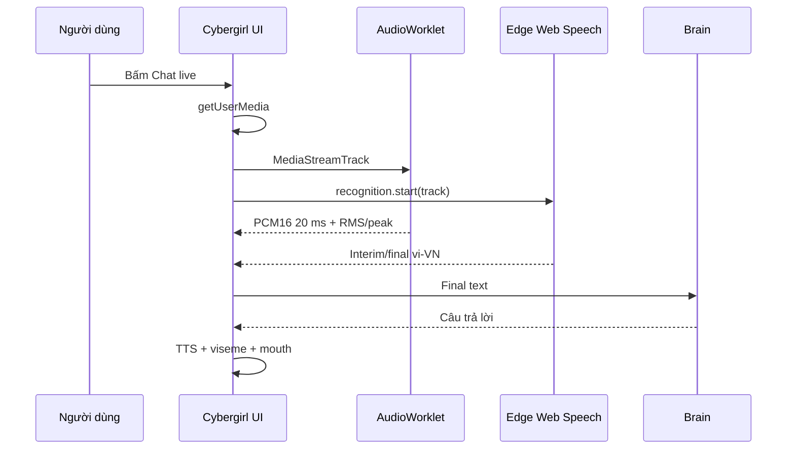
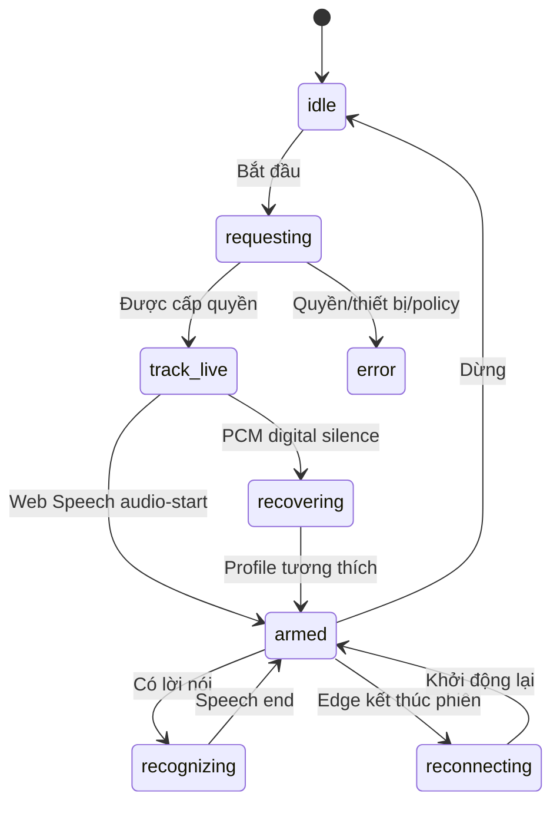

# Kiến trúc Cybergirl 5.2

## Mục tiêu

Cybergirl 5.2 loại bỏ sai lệch giữa bản Edge Extension và bản Windows bằng ba
quy tắc:

1. Frontend chỉ có một bản: `index.html`, `styles.css`, `app.js`.
2. Microphone chỉ có một engine: `audio/pcm-web-speech.js`.
3. PCM chỉ có một hợp đồng: signed 16-bit little-endian, 16 kHz, mono, 20 ms.

Windows EXE đóng gói nguyên frontend này và phục vụ từ `127.0.0.1`; Extension
nạp trực tiếp cùng tệp từ package Manifest V3.

## Ranh giới host và core

| Lớp | Trách nhiệm | Có khác theo host? |
|---|---|---:|
| Host | Mở trang, cấp backend LLM/API | Có |
| UI core | Avatar, chat, microphone, TTS, export | Không |
| Audio core | Track, PCM16, Web Speech, telemetry | Không |
| Brain adapter | Demo, GGUF, Ollama, remote API | Có |
| Avatar engine | Face Mesh, mouth, eyes, emotion | Không |

### Extension

- `background.js` mở dashboard.
- Native Messaging là tùy chọn.
- Nếu không có companion, Demo cục bộ vẫn hoàn tất pipeline.
- Không cần `host_permissions` cho chế độ chạy ngay.

### Windows

- `cybergirl.py` mở loopback server có token phiên.
- PyInstaller nhúng đúng frontend và thư mục `audio/`.
- Microsoft Edge được mở bằng `--app=<loopback-url>`.
- Backend Python chỉ nhận text; microphone không đi qua Python.

## Luồng microphone

`AudioWorklet` và `SpeechRecognition` cùng đọc một track. Điều này giải quyết
lỗi phổ biến: meter báo có âm thanh nhưng STT nghe micro khác, hoặc STT có text
nhưng lip-sync nhận digital silence.

## Trạng thái engine

## Bảo mật

- Server Windows chỉ bind `127.0.0.1`.
- POST API yêu cầu token 256-bit của phiên.
- API key không được ghi vào storage hay file.
- Extension không có host permission rộng.
- Ảnh và landmark không đi vào brain adapter.
- Raw PCM không được gửi tới backend LLM.
- Edge Web Speech có chính sách dữ liệu riêng của Microsoft.

## Bản phát hành

Workflow dùng đúng source state để tạo:

- Extension ZIP;
- Windows one-file EXE;
- Native Companion EXE;
- Inno Setup.

Tag `v*` tạo Release và đính kèm các artifact, bảo đảm tên phiên bản Extension,
package, footer, installer và workflow được kiểm thử đồng bộ.
